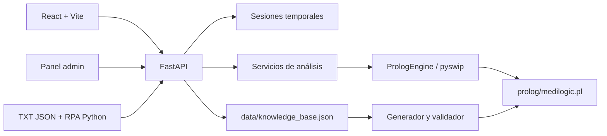
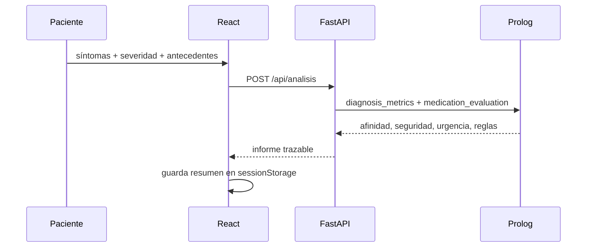
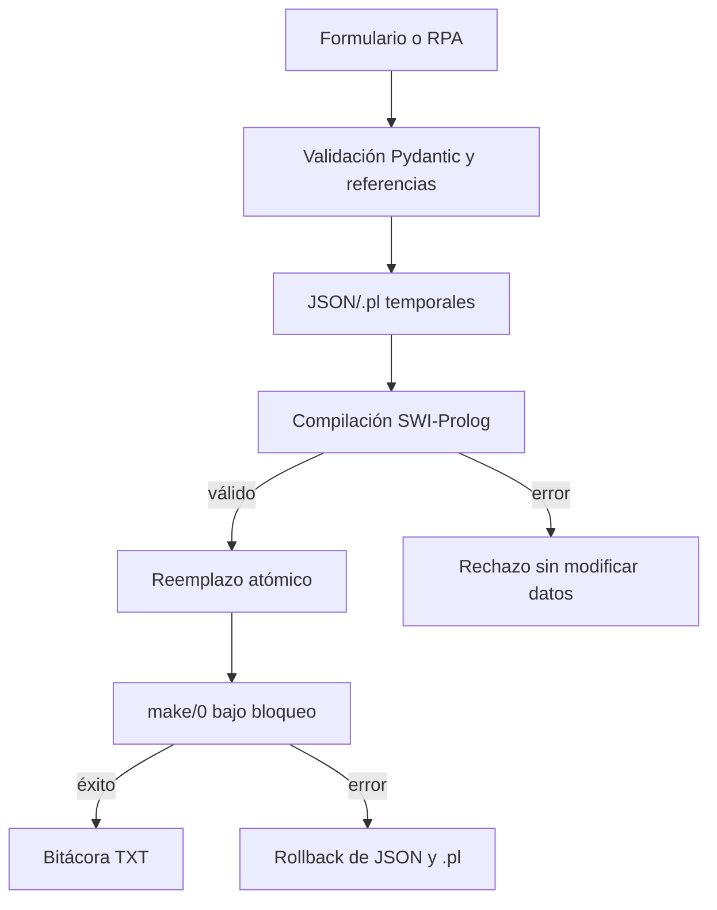

# Diagramas de MediLogic

## Arquitectura

```mermaid
flowchart LR
  UI[React + Vite] --> API[FastAPI]
  API --> AUTH[Sesiones temporales]
  API --> SERVICE[Servicios de análisis]
  SERVICE --> PY[PrologEngine / pyswip]
  PY --> PL[prolog/medilogic.pl]
  ADMIN[Panel admin] --> API
  API --> JSON[data/knowledge_base.json]
  JSON --> GEN[Generador y validador]
  GEN --> PL
  RPA[TXT JSON + RPA Python] --> API
```

## Flujo del paciente

```mermaid
sequenceDiagram
  participant P as Paciente
  participant F as React
  participant B as FastAPI
  participant L as Prolog
  P->>F: síntomas + severidad + antecedentes
  F->>B: POST /api/analisis
  B->>L: diagnosis_metrics + medication_evaluation
  L-->>B: afinidad, seguridad, urgencia, reglas
  B-->>F: informe trazable
  F->>F: guarda resumen en sessionStorage
```

## Mutación administrativa

```mermaid
flowchart TD
  A[Formulario o RPA] --> V[Validación Pydantic y referencias]
  V --> T[JSON/.pl temporales]
  T --> C[Compilación SWI-Prolog]
  C -->|válido| R[Reemplazo atómico]
  R --> M[make/0 bajo bloqueo]
  M -->|éxito| L[Bitácora TXT]
  M -->|error| RB[Rollback de JSON y .pl]
  C -->|error| E[Rechazo sin modificar datos]
```

